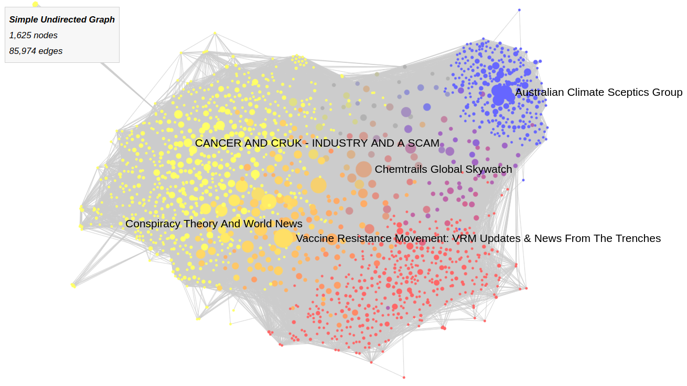

# WEBCLIM

Our general goal in WebClim is to better understand the fake news ecosystem about climate change.

This specific projet maps the Facebook groups sharing news labelled as fake by the Science Feedback reviewers. We have published the results in [a Franch article on the medialab website](https://medialab.sciencespo.fr/actu/une-cartographie-facebook-des-infox-scientifiques-sur-le-climat/).



### Installations

This project was developed on Python 3.7.6, so you should first install Python. 
Then run these commands in your terminal (in a virtualenv if you prefer):

```
git clone https://github.com/medialab/webclim_analyses
cd webclim_analyses
pip install -r requirements.txt
```
You should also export the two following tables in a CSV format from the Science Feedback database:
* "Appearances-Grid view.csv"
* "Reviews _ Fact-checks-Grid view.csv"

And put them in the `raw_data` folder. 

You should finally get a crowdtangle token and write it in a `config.json` file similar to the `config.json.example` file 
(except that you should write the token value instead of "blablabla").

### Run the analysis topic by topic

You can first analyze the Facebook groups sharing fake news about the climate.
First run this command to clean the Science Feedback data:
```
python clean_data.py climate
```
This command will fetch the Facebook groups having shared the fake news listed by Science Feedback. It should take a certain time to run (1-2 hours):
```
./minet_requests.sh climate
```
Finally you should run this to create the corresponding graph:
```
python create_topic_graph.py climate
```
Each command should be run in order because each will use the output of the former as its input.

You can run the same analysis on the fake news about health:
```
python clean_data.py health
./minet_requests.sh health
python create_topic_graph.py health
```

or about COVID-19:
```
python clean_data.py COVID-19
./minet_requests.sh COVID-19
python create_topic_graph.py COVID-19
```

### Create a global graph and compare the topics
You can only run this command if you have run all the commands above because we will use their data:
```
python create_global_graph.py
```

### Minivan quick hack
This little hack is to manipulate the colors put by minivan when creating the json graph:
```
python quick_fix_for_minivan_colors.py climate
python quick_fix_for_minivan_colors.py health
python quick_fix_for_minivan_colors.py COVID-19
```
